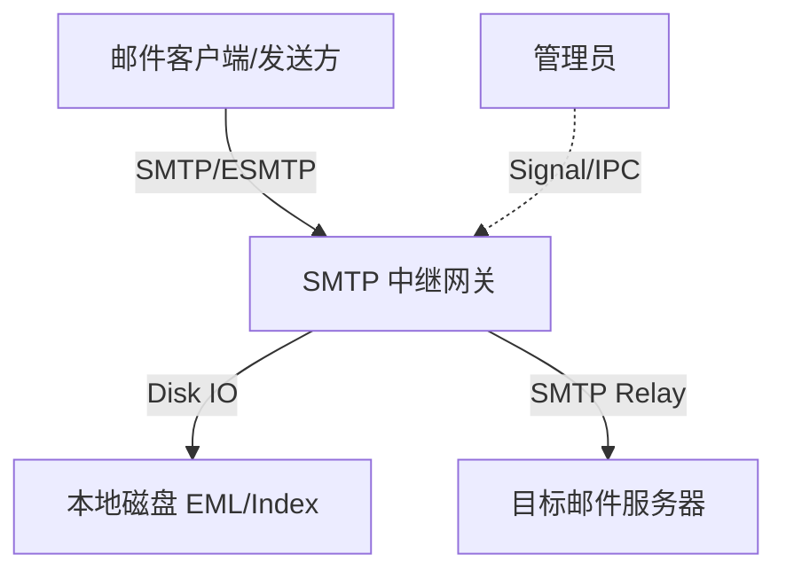
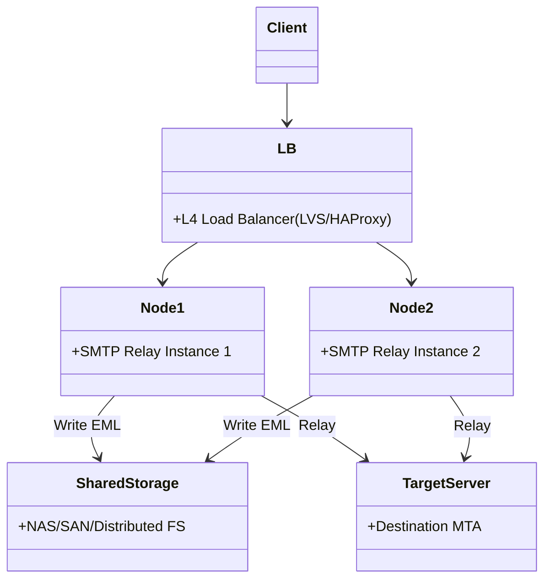
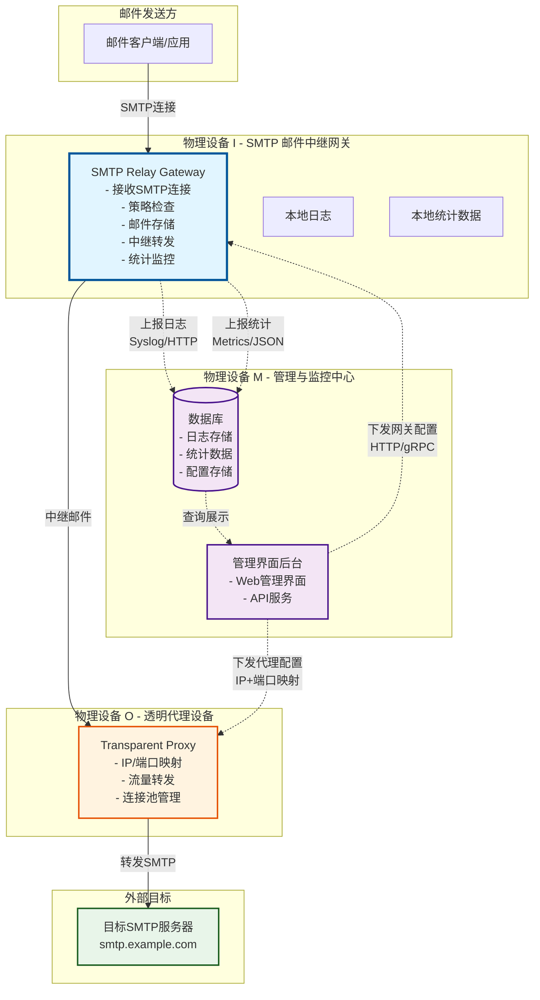
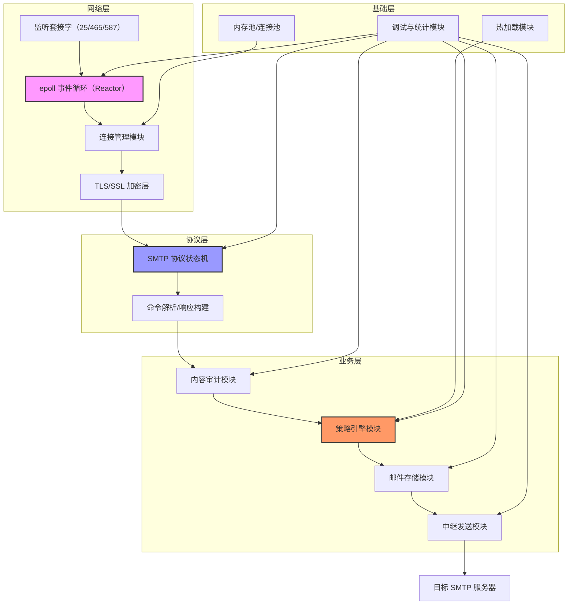
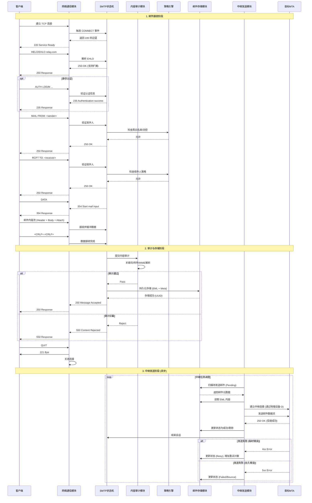
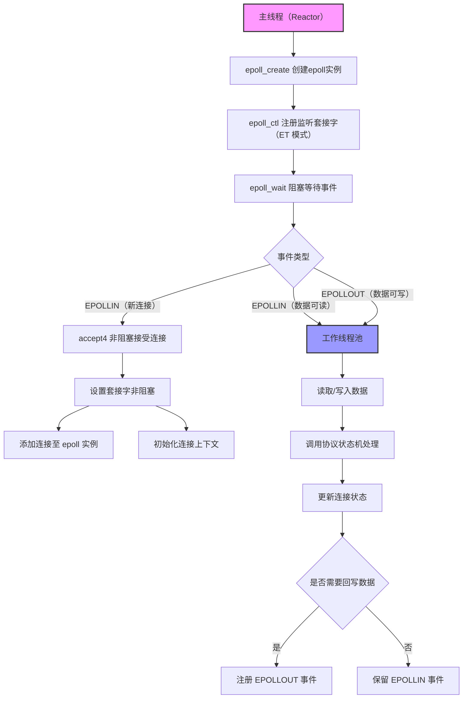
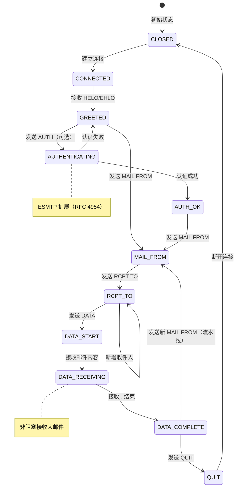
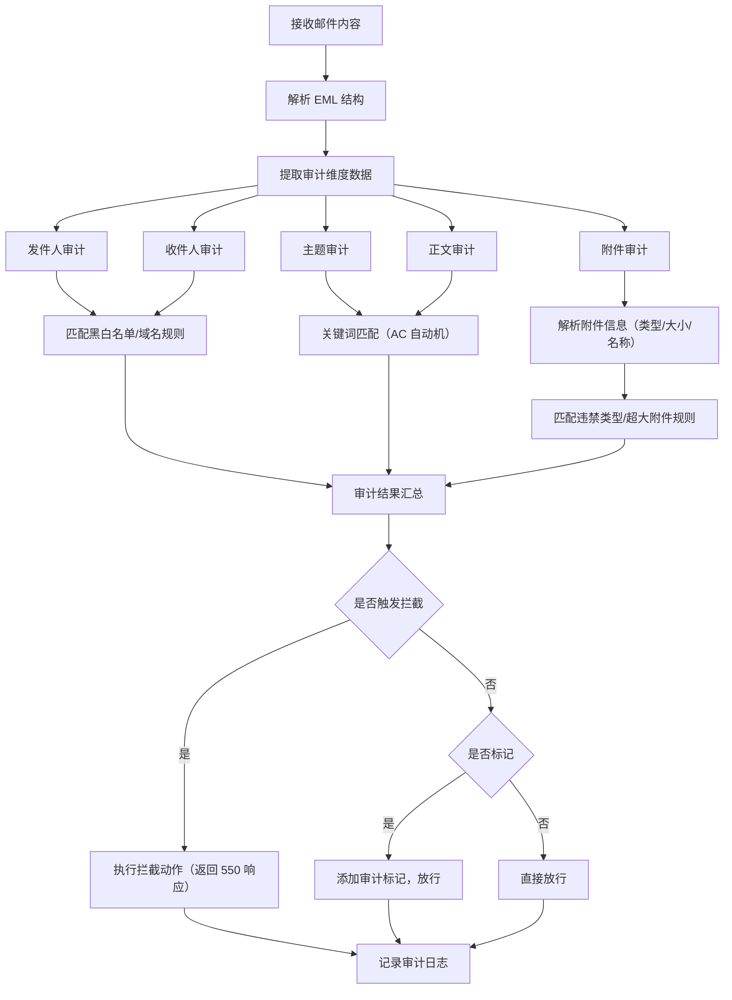
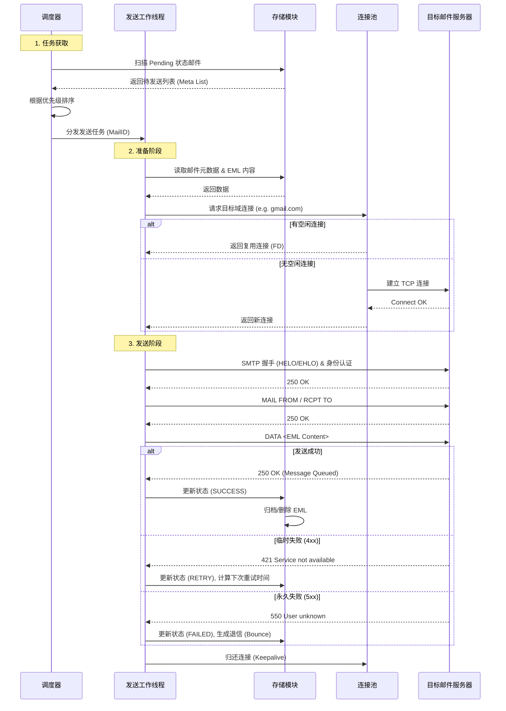
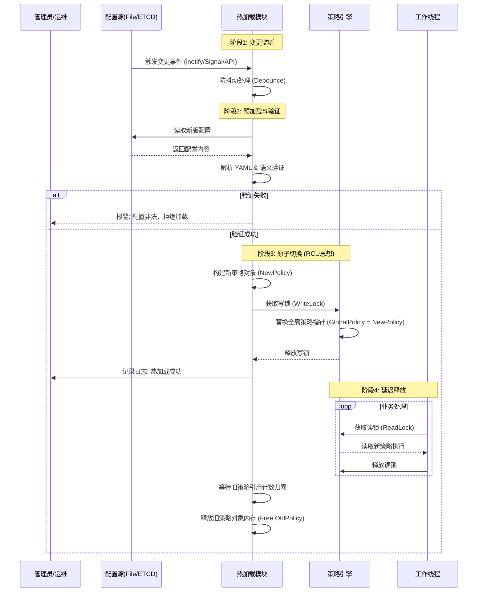

# SMTP 邮件中继网关 - 详细设计文档
**软件名称**：HighPerfSMTP Relay  
**版本**：v1.0  
**设计人**：Linux 高性能网络编程架构师  
**日期**：2026-01-07  

## 目录
- [1. 概述](#1-概述)
- [2. 部署模式](#2-部署模式)
- [3. 主框架设计](#3-主框架设计)
- [4. 关键模块设计](#4-关键模块设计)
  - [4.1 SMTP 协议状态机](#41-smtp-协议状态机)
  - [4.2 异步非阻塞 IO 框架](#42-异步非阻塞-io-框架)
  - [4.3 策略引擎与热加载](#43-策略引擎与热加载)
  - [4.4 邮件存储与中继发送](#44-邮件存储与中继发送)
  - [4.5 内容审计模块](#45-内容审计模块)
- [5. 调试与统计设计](#5-调试与统计设计)
- [6. 扩展设计](#6-扩展设计)
- [7. 性能优化点](#7-性能优化点)
- [8. 风险与应对](#8-风险与应对)

## 1. 概述
### 1.1 背景
传统 SMTP 中继软件多采用同步阻塞模型，在高并发场景下存在连接数受限、响应延迟高、资源利用率低等问题；同时缺乏灵活的策略管控与内容审计能力，无法满足企业级邮件中继的安全与性能需求。

### 1.2 目标
开发一款基于 Linux 平台的高性能异步非阻塞 SMTP 邮件中继网关，具备高并发处理、灵活策略管控、内容审计、热加载等核心能力，满足企业级邮件中继的高性能、高可用、高安全需求。

### 1.3 核心特性
- 异步非阻塞 IO 模型，支持高并发连接处理；
- 完整实现 SMTP/ESMTP/SMTPS 协议（兼容 RFC 5321/RFC 4954）；
- 邮件内容 EML 格式持久化存储，支持生命周期管理；
- 灵活的中继策略引擎，支持热加载（无需重启进程）；
- 多维度邮件内容审计，支持拦截/放行/标记策略；
- 完善的日志分级与性能指标统计；
- 模块化设计，易扩展、易维护。

### 1.4 运行环境
| 类别       | 要求                                                               |
| ---------- | ------------------------------------------------------------------ |
| 操作系统   | CentOS 7+/Ubuntu 20.04+                                            |
| 内核版本   | ≥ 4.14                                                             |
| 编译器     | GCC ≥ 9.0                                                          |
| 构建工具   | Make/CMake                                                         |
| 核心依赖库 | OpenSSL (≥1.1.1)、libyaml (≥0.2.5)、libevent (可选)、inotify-tools |

## 2. 部署模式
### 2.1 单机部署
适用于中小规模流量或开发测试环境。所有模块运行在同一进程或同一服务器的不同进程中。


### 2.2 集群部署（主从+负载均衡）
适用于生产环境，前端通过 4 层负载均衡器分发流量，后端共享存储或独立存储（依赖应用层重试）。



## 3. 主框架设计

### 3.0 系统物理拓扑框图

本节描述 SMTP 邮件中继网关系统在S01上的物理架构，包括三个(I、M、O)节点设备之间的交互关系。



#### 物理设备职责说明

**物理设备 I - SMTP 邮件中继网关**
- **主要职责**: 
  - 接收来自邮件客户端的 SMTP 连接
  - 执行策略检查（黑白名单、速率限制等）
  - 邮件内容存储与管理
  - 通过透明代理转发邮件到目标服务器
  - 收集统计信息和生成日志
- **通信接口**:
  - 入向：监听 SMTP 端口（25/465/587）
  - 出向：连接物理设备 O 进行邮件中继
  - 管理：接收物理设备 M 的配置下发
  - 监控：向物理设备 M 上报日志和统计

**物理设备 O - 透明代理设备**
- **主要职责**:
  - 作为 SMTP 邮件中继网关的出口代理
  - 执行 IP 地址映射和端口转发
  - 管理与目标 SMTP 服务器的连接池
  - 隐藏中继网关的真实出口 IP
- **通信接口**:
  - 入向：接收来自物理设备 I 的中继请求
  - 出向：连接外部目标 SMTP 服务器
  - 管理：接收物理设备 M 的代理配置（IP+端口映射）

**物理设备 M - 管理与监控中心**
- **主要职责**:
  - **管理界面后台**:
    - 提供 Web 管理界面和 API 服务
    - 下发 SMTP 邮件中继网关的运行配置（策略、参数等）
    - 下发透明代理设备的路由配置（目标IP+端口映射）
    - 展示邮件网关的实时统计信息（吞吐量、成功率等）
  - **数据库系统**:
    - 存储邮件网关上报的日志数据
    - 存储统计指标和监控数据
    - 存储配置版本和历史记录
- **通信接口**:
  - 向物理设备 I 下发配置
  - 向物理设备 O 下发代理配置
  - 接收物理设备 I 的日志和统计数据
  - 对外提供管理界面访问

#### 数据流说明

1. **邮件处理流** (实线)：
   ```
   邮件客户端 → 物理设备I(中继网关) → 物理设备O(代理) → 目标SMTP服务器
   ```

2. **配置管理流** (虚线)：
   ```
   物理设备M(管理后台) → 物理设备I(网关配置)
   物理设备M(管理后台) → 物理设备O(代理配置)
   ```

3. **监控数据流** (虚线)：
   ```
   物理设备I(日志/统计) → 物理设备M(数据库) → 物理设备M(界面展示)
   ```

---

### 3.1 整体架构图


### 3.2 核心模块划分
| 模块名称            | 核心职责                                                | 关键接口示例                                          |
| :------------------ | :------------------------------------------------------ | :---------------------------------------------------- |
| **网络通信模块**    | 异步非阻塞 IO 管理、TLS/SSL 加密、连接生命周期管理      | `net_accept()`, `net_send_async()`, `ssl_handshake()` |
| **SMTP 协议状态机** | 实现 SMTP/ESMTP/SMTPS 协议状态流转，解析/响应 SMTP 命令 | `smtp_proto_parse()`, `smtp_state_machine_step()`     |
| **策略引擎模块**    | 中继策略（路由、流控）、审计策略、重试策略的执行与管理  | `policy_check_access()`, `policy_get_route()`         |
| **热加载模块**      | 监听配置变更，原子化更新策略，支持回滚                  | `config_check_update()`, `config_reload_atomic()`     |
| **邮件存储模块**    | EML 格式持久化、元数据索引、存储生命周期管理            | `store_save_eml()`, `store_load_meta()`               |
| **中继发送模块**    | 从 EML 还原邮件、异步投递、失败重试、退信处理           | `relay_queue_push()`, `relay_worker_process()`        |
| **内容审计模块**    | 解析 EML 内容，执行审计规则匹配，输出审计结果           | `audit_scan_content()`, `audit_check_attachment()`    |
| **调试与统计模块**  | 日志分级输出、性能指标统计、调试接口实现                | `stats_inc_metric()`, `log_write_async()`             |
| **基础组件模块**    | 内存池、连接池、无锁队列等基础组件封装                  | `mempool_alloc()`, `ringbuffer_write()`               |

### 3.4 数据流转全流程


### 3.5 管理中心配置下发与热加载设计

基于物理设备 M（管理中心）、物理设备 I（中继网关）和物理设备 O（透明代理）的协作关系，配置下发与生效流程设计如下：

#### 3.5.1 配置下发流程
1. **界面操作**：管理员在物理设备 M 的 Web 界面修改配置（如黑名单、审计词库、路由映射）并点击“应用”。
2. **后台封装**：管理后台将差异配置或全量配置封装为标准的 YAML 文件。
3. **分发传输**：
    - 管理中心通过安全通道（fileferry）将配置文件推送到物理设备 I 的指定路径（`/etc/relaymail/config/`）。
    - 管理中心同步向物理设备 O 下发 `IP + Port` 的透明代理转发规则配置。
4. **触发更新**：管理中心向网关进程发送 `SIGHUP` 信号，或网关的 `inotify` 自动识别物理文件的变更并触发重载。

#### 3.5.2 核心下发配置项
以下是根据 3.4 节数据流识别出的、必须由界面集中管理的配置项：

| 物理设备   | 配置类别     | 关键配置项                                        | 作用描述                                            |
| :--------- | :----------- | :------------------------------------------------ | :-------------------------------------------------- |
| **设备 I** | **策略规则** | `policy.blacklist.ip`, `policy.rate_limit.per_ip` | 过滤恶意 IP 连接及控制单个 IP 的发信频率            |
|            | **认证信息** | `auth.users` (包含账号及加密密码)                 | 用于客户端连接时的身份强制认证（见 3.4 节认证阶段） |
|            | **审计词库** | `audit.keywords`, `audit.attachment_types`        | 匹配邮件内容敏感词及管控高危附件类型                |
|            | **路由映射** | `upstream.route_map`                              | 决定特定的发件域或收件域通过哪个出口/代理中继       |
| **设备 O** | **代理映射** | `proxy.port_maps`, `proxy.target_mapping`         | 将网关送达的流量转发至具体的目标代理服务器及端口    |

#### 3.5.3 热加载技术实现 (Hot-Reload)
网关（物理设备 I）采用**分级热加载**机制，确保无需重启进程即可更新业务策略：
1. **双缓冲原子切换**：使用 `pthread_rwlock_t` 读写锁。工作线程持有“读锁”访问配置，热加载线程持有“写锁”瞬间完成新旧配置指针切换。
2. **安全校验**：加载新配置后首行调用 `config_validate` 函数进行完整性与逻辑校验。若校验失败，则拒绝切换并保留旧配置在内存中运行，同时向物理设备 M 上报配置错误。
3. **资源延时回收**：旧配置指针在切换后不会立即释放，而是等待当前所有使用该引用的工作线程退出后，由垃圾回收机制（或延迟计数器）统一清理。

---

## 4. 关键模块设计
### 4.1 网络层 (Network Layer)
#### 4.1.1 异步非阻塞 IO 框架
**Reactor 模式实现图**


**epoll 事件处理流程**
1. **初始化阶段**：
   - 主线程创建 epoll 实例（`epoll_create1(EPOLL_CLOEXEC)`）；
   - 创建监听套接字，设置为非阻塞模式，绑定端口（25/465/587）；
   - 通过 `epoll_ctl` 注册监听套接字的 EPOLLIN 事件（ET 边缘触发模式）。

2. **事件循环阶段**：
   - 主线程调用 `epoll_wait` 阻塞等待事件，超时时间设为 100ms；
   - 当监听到新连接事件（EPOLLIN）：
     - 调用 `accept4` 非阻塞接受连接，设置 `SOCK_NONBLOCK | SOCK_CLOEXEC`；
     - 初始化连接上下文（存储 FD、状态、缓冲区、TLS 上下文等）；
     - 将新连接 FD 注册到 epoll 实例，监听 EPOLLIN 事件。
   - 当监听到数据可读/可写事件：
     - 将连接上下文放入无锁队列，通知工作线程池处理；
     - 工作线程读取/写入数据，调用协议状态机处理；
     - 处理完成后，根据需要注册 EPOLLOUT 事件（回写响应）或保留 EPOLLIN 事件。

3. **连接清理阶段**：
   - 检测连接超时/错误/主动关闭事件；
   - 调用 `epoll_ctl` 移除 FD，关闭套接字，释放连接上下文。

**关键实现细节**
- **ET 模式选型**：相比 LT 模式，ET 模式减少事件触发次数，降低 CPU 开销，需确保一次性读取/写入所有数据；
- **无锁队列**：主线程与工作线程间采用基于环形缓冲区的无锁队列，减少线程切换开销；
- **连接池**：预分配连接上下文内存，避免频繁 malloc/free，减少内存碎片；
- **TLS 异步处理**：将 TLS 握手/加密/解密操作放入工作线程，避免阻塞主线程事件循环。

**Reactor接口定义**:
```c
// 事件类型定义
#define EVENT_NONE  0x00
#define EVENT_READ  0x01    // 可读事件 (EPOLLIN)
#define EVENT_WRITE 0x02    // 可写事件 (EPOLLOUT)
#define EVENT_ERROR 0x04    // 错误事件 (EPOLLERR/EPOLLHUP)

// Reactor 事件结构
typedef struct reactor_event {
    int fd;                           // 文件描述符
    int events;                       // 监听的事件类型
    event_handler_pt handler;         // 事件回调函数
    void *arg;                        // 回调参数 (通常是connection_t*)
} reactor_event_t;

// 创建事件循环 (size参数暂未使用，预留扩展)
event_loop_t *event_loop_create(int size);

// 销毁事件循环并释放资源
void event_loop_destroy(event_loop_t *loop);

// 添加事件到循环 (epoll_ctl ADD)
int event_loop_add(event_loop_t *loop, reactor_event_t *event);

// 从循环中删除事件 (epoll_ctl DEL)
int event_loop_del(event_loop_t *loop, reactor_event_t *event);

// 修改事件类型 (epoll_ctl MOD)
int event_loop_mod(event_loop_t *loop, reactor_event_t *event, int new_events);

// 运行事件循环 (阻塞，直到调用 event_loop_stop)
void event_loop_run(event_loop_t *loop);

// 停止事件循环
void event_loop_stop(event_loop_t *loop);
```

**Reactor实现要点**:
- 使用 Linux `epoll` API (epoll_create1 + epoll_ctl + epoll_wait)
- ET (边缘触发) 模式，配合 EPOLLET 标志
- 超时设为 100ms，支持优雅退出
- 每次 `epoll_wait` 最多处理 1024 个事件

#### 4.1.2 连接管理模块设计
负责 TCP 连接的全生命周期管理，确保高并发下的资源受控。

**核心功能**:
- **连接对象池化**: 预分配 `connection_t` 结构体数组，避免 `malloc` 开销。
- **状态管理**: 维护连接的 `state` (INIT/HANDSHAKE/ESTABLISHED/CLOSING) 与 `flags` (SSL/AUTH)。
- **超时控制**: 基于时间轮 (Timing Wheel) 实现秒级精度的超时检测。
  - `idle_timeout`: 空闲超时 (默认 60s)。
  - `data_timeout`: 数据传输超时 (默认 300s)。
- **限制控制**:
  - `max_connections`: 全局最大连接数 (如 10000)。
  - `max_per_ip`: 单 IP 最大连接数限制。

**数据结构**:
```c
typedef struct connection {
    int fd;                          // 套接字文件描述符
    struct sockaddr_in addr;         // 客户端地址信息
    
    buffer_t *in_buf;                // 输入缓冲区 (动态扩展)
    buffer_t *out_buf;               // 输出缓冲区 (写队列)
    
    event_loop_t *loop;              // Reactor 事件循环引用
    reactor_event_t event;           // 嵌入的 epoll 事件上下文
    
    // TLS 状态
    SSL *ssl;                        // OpenSSL 上下文 (NULL 表示明文)
    int tls_enabled;                 // TLS 是否启用
    int tls_handshake_done;          // TLS 握手是否完成
    
    void *proto_ctx;                 // 协议层上下文 (smtp_session_t*)
    
    int closing;                     // 连接关闭标志
} connection_t;
```

**核心函数接口**:
```c
// 接受新连接 (从监听 socket)
connection_t *connection_accept(event_loop_t *loop, int server_fd);

// 关闭连接并释放资源
void connection_close(connection_t *conn);

// 读事件处理器 (Reactor 回调)
void connection_on_read(int fd, int events, void *arg);

// 写事件处理器 (Reactor 回调)
void connection_on_write(int fd, int events, void *arg);

// 发送数据 (排队到 out_buf，注册写事件)
int connection_send(connection_t *conn, const void *data, size_t len);

// TLS 升级 (STARTTLS 命令触发)
int connection_start_tls(connection_t *conn, SSL_CTX *ctx);
```

### 4.2 协议层 (Protocol Layer)
#### 4.2.1 SMTP 协议状态机
**状态流转图**


**核心状态逻辑**
| 状态           | 输入命令         | 处理逻辑                                                                 | 响应码  |
| -------------- | ---------------- | ------------------------------------------------------------------------ | ------- |
| CONNECTED      | HELO/EHLO        | 验证域名格式，记录客户端标识，返回支持的 ESMTP 扩展（如 AUTH、STARTTLS） | 250     |
| AUTHENTICATING | AUTH LOGIN/PLAIN | 解析认证信息，对接用户认证模块，验证账号密码                             | 235/535 |
| MAIL_FROM      | MAIL FROM:<...>  | 验证发件人格式，检查发件人黑白名单                                       | 250/550 |
| RCPT_TO        | RCPT TO:<...>    | 验证收件人格式，检查收件人黑白名单，支持多收件人                         | 250/550 |
| DATA_START     | DATA             | 准备接收邮件内容，返回 354 响应                                          | 354     |
| DATA_RECEIVING | 邮件内容         | 异步读取内容，限制邮件大小，检测结束符（.）                              | -       |
| DATA_COMPLETE  | .                | 结束内容接收，触发审计/存储流程                                          | 250     |

**ESMTP/SMTPS 扩展实现**
- **ESMTP 扩展**：支持 EHLO 命令、AUTH 认证（PLAIN/LOGIN 机制）、SIZE 邮件大小限制、8BITMIME 编码；
- **SMTPS 实现**：基于 OpenSSL 库，在 465 端口实现 TLS 加密（SSLv3/TLSv1.2/TLSv1.3），支持证书验证；
- **STARTTLS 扩展**：在 587 端口支持 STARTTLS 命令，实现明文连接升级为加密连接。

**实际数据结构** (`include/smtp_server.h`):
```c
// SMTP 状态定义
typedef enum {
    SMTP_STATE_CONNECT,       // 新连接建立
    SMTP_STATE_GREETING,      // 发送欢迎消息
    SMTP_STATE_HELO,          // 已接收 HELO/EHLO
    SMTP_STATE_MAIL,          // 已接收 MAIL FROM
    SMTP_STATE_RCPT,          // 已接收 RCPT TO
    SMTP_STATE_DATA,          // 已接收 DATA 命令
    SMTP_STATE_DATA_CONTENT,  // 正在接收邮件内容
    SMTP_STATE_QUIT,          // 已接收 QUIT
    SMTP_STATE_ERROR          // 错误状态
} smtp_state_t;

// SMTP 信封结构
typedef struct {
    char *sender;            // 发件人 (mempool 分配)
    char **recipients;       // 收件人数组 (mempool 分配)
    int recipient_count;     // 当前收件人数量
    int recipient_capacity;  // 收件人数组容量
} smtp_envelope_t;

// SMTP 会话上下文
typedef struct smtp_session {
    connection_t *conn;           // 关联的连接对象
    mempool_t *pool;              // 会话级内存池 (减少碎片)
    storage_ctx_t *store_ctx;     // 存储事务句柄
    
    smtp_state_t state;           // 当前SMTP状态
    smtp_envelope_t env;          // 信封信息
    
    char cmd_buffer[1024];        // 命令缓冲区 (行解析)
    
    int is_esmtp;                 // 是否为 ESMTP 模式
} smtp_session_t;
```

**核心函数接口**:
```c
// 设置全局SSL上下文 (由main.c调用)
void smtp_server_set_ssl_ctx(SSL_CTX *ctx);

// 初始化 SMTP 会话 (绑定到连接)
void smtp_session_init(smtp_session_t *session, connection_t *conn);

// 销毁会话并释放资源
void smtp_session_destroy(smtp_session_t *session);

// 处理输入数据 (由connection层回调)
void smtp_process(smtp_session_t *session);
```

#### 4.3.1 策略引擎模块

**设计说明**：
策略引擎负责连接准入控制、发件人/收件人合规性验证以及邮件路由决策。它支持多维度规则定义，并能够通过管理中心（物理设备 M）下发的配置实时更新。

**策略处理流程**:
1. **连接级策略**: 在 `connection_accept` 时调用 `policy_check_connection`，根据IP黑白名单决定是否接受连接。
2. **发件人策略**: 在处理 `MAIL FROM` 命令时调用 `policy_check_sender`，验证发件人域名和地址。
3. **收件人策略**: 在处理 `RCPT TO` 命令时调用 `policy_check_recipient`，支持收件人白名单限制。

**策略模型 (YAML 配置格式)**:
策略配置由管理中心下发，涵盖以下维度：
```yaml
# 策略规则配置 (由物理设备 M 下发至物理设备 I)
policy:
  blacklist:
    ip: ["192.168.1.100", "10.0.0.50"]      # IP 黑名单
    sender: ["spam@bad.com", "*@malicious.org"] # 发件人黑名单 (支持通配符)
    recipient: ["blocked@internal.com"]      # 收件人禁信名单
  whitelist:
    ip: ["127.0.0.1", "172.16.0.0/16"]      # IP 白名单 (免审计/免流控)
  rate_limit:
    max_conn_per_ip: 50                     # 单IP并发数限制
    max_mails_per_min: 100                  # 单IP每分钟发信速率限制
  route:
    - domain: "internal.com"
      gateway: "10.0.1.10:25"               # 内部域专用网关
    - domain: "*"
      gateway: "relay-proxy:25"             # 默认走向物理设备 O (透明代理)
```

**核心函数接口定义**:
```c
// 初始化策略引擎
int policy_init(config_t *config);

// 检查连接IP是否允许 (返回0允许，非0拒绝)
int policy_check_connection(const char *ip);

// 检查发件人是否允许
int policy_check_sender(const char *sender);

// 检查收件人是否允许
int policy_check_recipient(const char *recipient);
```
#### 4.3.2 内容审计模块
**审计流程**


**核心审计维度与规则**
| 审计维度 | 审计规则                                       | 实现方式                                                    |
| -------- | ---------------------------------------------- | ----------------------------------------------------------- |
| 发件人   | 域名是否合规、是否在黑白名单、是否为伪造发件人 | 正则匹配域名、哈希表查询黑白名单                            |
| 收件人   | 是否在白名单、是否为禁止收件人、收件人数量限制 | 哈希表查询、计数判断                                        |
| 主题     | 敏感关键词匹配、长度限制                       | AC 自动机算法（高效匹配多关键词）、长度检测                 |
| 附件     | 类型（MIME 类型/后缀）、大小、数量             | 解析 Content-Disposition 头、文件大小统计、违禁类型列表匹配 |
| 正文     | 文本/HTML 敏感词匹配、HTML 恶意标签检测        | AC 自动机、HTML 解析器（libxml2）、恶意标签规则库           |

**数据解析方法**
- **EML 解析**：基于 RFC 5322 规范，解析邮件头（From/To/Subject/Content-Type 等）与邮件体；
- **MIME 解析**：支持多部分邮件（multipart/*）、附件提取、编码转换（base64/quoted-printable）；
- **HTML 解析**：使用 libxml2 解析 HTML 正文，过滤脚本/恶意标签，提取纯文本内容用于审计；
- **大邮件处理**：分段读取 EML 文件，避免一次性加载至内存，降低内存占用。

**审计结果处理**
| 审计结果 | 动作                                                       | 响应码/处理逻辑                              |
| -------- | ---------------------------------------------------------- | -------------------------------------------- |
| 放行     | 允许中继，记录审计日志                                     | SMTP 响应 250 OK                             |
| 拦截     | 拒绝中继，返回错误响应                                     | SMTP 响应 550 5.7.1 Blocked by content audit |
| 标记     | 允许中继，添加审计标记（邮件头 X-Audit-Tag），记录审计日志 | SMTP 响应 250 OK，中继时携带标记             |

#### 4.3.3 邮件存储与中继发送
**EML 存储结构**
| 部分       | 存储内容                                                             | 格式/路径规范                                                          |
| ---------- | -------------------------------------------------------------------- | ---------------------------------------------------------------------- |
| EML 文件   | 完整邮件内容（符合 RFC 5322）                                        | 路径：`/var/lib/highperfsmtp/mails/{YYYYMMDD}/{UUID}.eml`              |
| 元数据索引 | 发件人、收件人、主题、时间戳、邮件大小、审计结果、中继状态、重试次数 | 格式：JSON；路径：`/var/lib/highperfsmtp/index/{YYYYMMDD}/{UUID}.json` |
| 状态标识   | 待中继/中继中/成功/失败/退信                                         | 元数据字段 + 文件系统扩展属性（xattr）：`user.relay_status`            |

**元数据示例**：
```json
{
  "uuid": "f81d4fae-7dec-11d0-a765-00a0c91e6bf6",
  "sender": "sender@example.com",
  "recipients": ["recipient1@example.com", "recipient2@example.com"],
  "subject": "Test Email",
  "timestamp": 1735689600,
  "size": 10240,
  "audit_result": "pass",
  "relay_status": "pending",
  "relay_servers": ["smtp1.example.com:25", "smtp2.example.com:25"],
  "retry_count": 0,
  "max_retry": 3,
  "retry_interval": 60
}
```

**存储生命周期管理**
- **成功中继**：可配置归档（移动至 `archive` 目录）或直接删除，保留时长可配置（如 7 天）；
- **失败中继**：达到最大重试次数后，标记为 `failed`，保留时长可配置（如 30 天），支持手动重试；
- **退信处理**：解析退信内容，记录退信原因，标记为 `bounced`，保留时长同失败邮件；
- **磁盘清理**：后台定时任务（基于 cron/定时器）清理超期文件，避免磁盘占满。

**核心函数接口**:
```c
// 初始化存储子系统 (创建目录结构)
int storage_init(const char *base_path);

// 打开新的存储事务 (返回上下文句柄)
// queue_id: 邮件唯一标识 (UUID或时间戳)
storage_ctx_t *storage_open(const char *queue_id);

// 追加数据到存储文件 (流式写入)
int storage_write(storage_ctx_t *ctx, const char *data, size_t len);

// 提交事务并关闭 (从 tmp/ 移动到 new/)
int storage_close(storage_ctx_t *ctx);

// 中止事务并删除临时文件
void storage_abort(storage_ctx_t *ctx);
```

**存储目录结构** (Maildir-like格式):
```
/var/spool/relaymail/
├── tmp/           # 临时文件 (正在写入)
├── new/           # 待中继邮件
├── queue/         # 中继队列 (scanner移动到此)
├── cur/           # 当前处理中
├── archive/       # 已成功中继 (可选)
└── failed/        # 失败邮件
```

**EML 还原发送流程**


**中继发送核心逻辑**
1. **连接管理**：
   - 目标 SMTP 服务器连接采用连接池管理，支持长连接复用；
   - 非阻塞连接建立，超时时间可配置（默认 5s）；
   - 支持负载均衡（轮询/加权轮询）与故障转移（服务器不可达时切换至备用节点）。

2. **SMTP 发送流程**：
   - 连接目标服务器，发送 EHLO/HELO 命令；
   - 若服务器要求认证，执行 AUTH 认证；
   - 发送 MAIL FROM/RCPT TO 命令；
   - 发送 DATA 命令，写入 EML 内容；
   - 发送 QUIT 命令，关闭连接；
   - 捕获服务器响应码，判断发送结果。

3. **重试策略**：
   - 失败类型区分：临时失败（如 4xx 响应码）触发重试，永久失败（如 5xx 响应码）不重试；
   - 重试间隔：采用指数退避策略（如 60s → 120s → 240s）；
   - 重试上限：可配置最大重试次数（默认 3 次）。

**中继模块核心函数接口**:
```c
// 初始化中继子系统 (配置worker数量)
int relay_init(config_t *config);

// 启动中继工作线程池 (Scanner + N Workers)
void relay_start(void);

// 停止中继服务 (优雅关闭)
void relay_stop(void);
```

**中继Worker Pool架构**:
- **Scanner线程**: 扫描 `new/` 目录，将文件移动到 `queue/` 并推送到任务队列
- **Worker线程池**: 从队列获取任务，建立上游SMTP连接，发送邮件
- **线程安全队列**: 使用 `pthread_mutex` 和 `pthread_cond` 实现阻塞式任务分发
- **配置参数**: `relay_threads` (默认4个worker)

**TLS加密模块接口** (`include/tls.h`):
```c
// 初始化 OpenSSL 库 (SSL_library_init等)
void tls_init_library(void);

// 创建 SSL 上下文 (服务器模式)
// 加载证书和私钥，返回 NULL 表示失败
SSL_CTX *tls_create_context(const char *cert_file, const char *key_file);

// 清理 OpenSSL 资源
void tls_cleanup(void);
```

**TLS功能特性**:
- **STARTTLS支持**: 在SMTP会话中升级为加密连接 (connection_start_tls)
- **SSL/TLS版本**: 支持 TLS 1.2+ (可配置最低版本)
- **证书配置**: 通过 `relay.yaml` 指定 `cert_file` 和 `key_file`
- **加密I/O**: connection层透明切换 `read/write` 和 `SSL_read/SSL_write`

### 4.4 基础层 (Infrastructure Layer)
#### 4.4.1 热加载模块
**热加载流程**


**热加载实现细节**
1. **触发方式**：
   - 文件监听：基于 inotify 机制监听配置文件目录，检测文件修改/新增/删除事件；
   - 信号触发：捕获 SIGHUP 信号，触发热加载；
   - API 调用：提供 HTTP/本地套接字 API，支持手动触发热加载。

2. **原子性保证**：
   - 采用读写锁（pthread_rwlock_t）：策略读取时加读锁（允许多线程并发读），策略更新时加写锁（排他锁）；
   - 配置加载流程：先加载新配置到临时内存，验证合法性，验证通过后原子替换旧配置，避免更新过程中策略异常。

3. **回滚机制**：
   - 记录策略版本信息（版本号、更新时间、配置内容哈希）；
   - 若新配置生效后检测到异常（如策略执行失败），支持通过信号/API 触发回滚至指定版本。

**核心函数接口**
```c
// 热加载触发
int strategy_hot_reload(const char* new_config, strategy_rollback_t* rollback_info);

// 策略回滚
int strategy_rollback(const strategy_rollback_t* rollback_info);
```

#### 4.4.2 基础组件
**内存池设计 (Memory Pool)**
为频繁分配的关键对象提供 Slab 分配器，降低内存碎片与缺页中断。

**策略**:
- **Fixed Pool**: 针对 `connection_t`, `smtp_session_t`, `buffer_node_t` 等定长对象。
- **Dynamic Pool**: 针对不定长的大块内存 (如邮件内容 buffer)，采用大块预分配 (Chunk) + 切分机制。

**核心函数接口**:
```c
void* mempool_alloc(mempool_t *pool);
void mempool_free(mempool_t *pool, void *ptr);
```


### 5.1 日志分级规则
| 级别  | 用途                             | 输出内容                                                    |
| ----- | -------------------------------- | ----------------------------------------------------------- |
| FATAL | 致命错误（进程无法运行）         | 模块名、时间戳、进程ID、错误码、错误描述、堆栈信息          |
| ERROR | 错误（功能异常，但进程可运行）   | 模块名、时间戳、进程/线程ID、错误码、错误描述、关键参数     |
| WARN  | 警告（非预期情况，但不影响功能） | 模块名、时间戳、进程/线程ID、警告描述、关键参数             |
| INFO  | 普通信息（关键流程执行）         | 模块名、时间戳、进程/线程ID、流程描述、关键参数             |
| DEBUG | 调试信息（详细流程执行）         | 模块名、时间戳、进程/线程ID、函数名、行号、变量值、流程步骤 |

#### 日志模块实际实现 (`include/logger.h`, `src/utils/logger.c`)

**数据结构**:
```c
// 日志级别定义
typedef enum {
    LOG_LEVEL_DEBUG = 0,
    LOG_LEVEL_INFO,
    LOG_LEVEL_WARN,
    LOG_LEVEL_ERROR,
    LOG_LEVEL_FATAL
} log_level_t;

// 日志输出方式
typedef enum {
    LOG_OUTPUT_STDOUT,   // 标准输出（适合前台调试）
    LOG_OUTPUT_FILE      // 文件输出（适合后台运行）
} log_output_t;
```

**核心接口**:
```c
// 初始化日志系统
int logger_init(log_output_t output, const char *logfile, log_level_t level);

// 销毁日志系统
void logger_destroy(void);

// 动态调整日志级别（运行时）
void logger_set_level(log_level_t level);

// 内部日志函数（由宏调用）
void logger_log(log_level_t level, const char *file, int line, 
                const char *fmt, ...);
```

**便捷宏** (自动记录文件名和行号):
```c
#define LOG_DEBUG(fmt, ...) \
    logger_log(LOG_LEVEL_DEBUG, __FILE__, __LINE__, fmt, ##__VA_ARGS__)
#define LOG_INFO(fmt, ...) \
    logger_log(LOG_LEVEL_INFO, __FILE__, __LINE__, fmt, ##__VA_ARGS__)
#define LOG_WARN(fmt, ...) \
    logger_log(LOG_LEVEL_WARN, __FILE__, __LINE__, fmt, ##__VA_ARGS__)
#define LOG_ERROR(fmt, ...) \
    logger_log(LOG_LEVEL_ERROR, __FILE__, __LINE__, fmt, ##__VA_ARGS__)
#define LOG_FATAL(fmt, ...) \
    logger_log(LOG_LEVEL_FATAL, __FILE__, __LINE__, fmt, ##__VA_ARGS__)
```

**日志输出格式示例**:
```
[2026-01-11 21:00:00] [INFO] [main.c:102] Server listening on 0.0.0.0:2525
[2026-01-11 21:00:15] [ERROR] [relay.c:234] Connect to smtp.example.com:25 failed: Connection refused
```

#### 日志输出格式（JSON 结构化）
```json
{
  "level": "ERROR",
  "module": "relay_send",
  "timestamp": 1735689600,
  "pid": 12345,
  "tid": 12346,
  "error_code": 1001,
  "error_msg": "Connect to smtp.example.com:25 failed",
  "params": {
    "mail_uuid": "f81d4fae-7dec-11d0-a765-00a0c91e6bf6",
    "target_server": "smtp.example.com:25",
    "timeout": 5000
  }
}
```

### 5.2 统计指标定义

#### 统计模块实际实现 (`include/stats.h`, `src/utils/stats.c`)

**原子计数器设计** (线程安全):
```c
// 基于 C11 原子操作的计数器
typedef struct {
    _Atomic uint64_t value;  // 硬件级原子性，无锁
} atomic_counter_t;

// 原子操作接口
void stats_inc(atomic_counter_t *counter);       // 原子递增
void stats_dec(atomic_counter_t *counter);       // 原子递减
void stats_add(atomic_counter_t *counter, uint64_t value);  // 原子加
uint64_t stats_get(const atomic_counter_t *counter);  // 原子读取
```

**全局统计数据结构**:
```c
typedef struct {
    // === 连接统计 ===
    atomic_counter_t active_connections;     // 当前活跃连接数
    atomic_counter_t total_connections;      // 累计连接总数
    atomic_counter_t rejected_connections;   // 拒绝连接数
    
    // === 邮件处理统计 ===
    atomic_counter_t emails_received;        // 接收的邮件总数
    atomic_counter_t emails_stored;          // 成功存储的邮件数
    atomic_counter_t emails_rejected;        // 拒绝的邮件数（策略）
    
    // === 中继统计 ===
    atomic_counter_t relay_success;          // 中继成功数
    atomic_counter_t relay_failed;           // 中继失败数
    atomic_counter_t relay_retrying;         // 正在重试的邮件数
    atomic_counter_t relay_queue_depth;      // 当前队列深度
    
    // === TLS统计 ===
    atomic_counter_t tls_handshakes;         // TLS 握手成功次数
    atomic_counter_t tls_errors;             // TLS 错误次数
    
    // === 时间戳 ===
    time_t start_time;                       // 进程启动时间
    time_t last_reset;                       // 上次重置时间
} stats_t;
```

**核心管理接口**:
```c
// 初始化统计系统
int stats_init(void);

// 销毁统计系统
void stats_destroy(void);

// 获取全局统计快照（线程安全）
void stats_snapshot(stats_t *snapshot);

// 重置统计（保留累计值）
void stats_reset(void);

// 格式化输出（文本格式，用于CLI）
void stats_format_text(char *buf, size_t size);

// 格式化输出（JSON格式，用于API）
void stats_format_json(char *buf, size_t size);
```

**便捷宏** (简化埋点代码):
```c
#define STATS_INC_CONNECTIONS()     stats_inc(&g_stats->total_connections)
#define STATS_INC_ACTIVE_CONN()     stats_inc(&g_stats->active_connections)
#define STATS_DEC_ACTIVE_CONN()     stats_dec(&g_stats->active_connections)
#define STATS_INC_EMAILS_RECEIVED() stats_inc(&g_stats->emails_received)
#define STATS_INC_RELAY_SUCCESS()   stats_inc(&g_stats->relay_success)
#define STATS_INC_TLS_HANDSHAKES()  stats_inc(&g_stats->tls_handshakes)
// ... 更多便捷宏
```

**统计埋点位置** (Instrumentation Points):

| 模块           | 埋点位置                      | 统计项                                        |
| -------------- | ----------------------------- | --------------------------------------------- |
| `connection.c` | `connection_accept()`         | `total_connections++`, `active_connections++` |
| `connection.c` | `connection_close()`          | `active_connections--`                        |
| `connection.c` | `connection_start_tls()` 成功 | `tls_handshakes++`                            |
| `connection.c` | `connection_start_tls()` 失败 | `tls_errors++`                                |
| `smtp.c`       | `process_data()` 接收完成     | `emails_received++`                           |
| `smtp.c`       | `storage_close()` 成功        | `emails_stored++`                             |
| `policy.c`     | 策略拒绝                      | `emails_rejected++`, `rejected_connections++` |
| `relay.c`      | `relay_process_file()` 成功   | `relay_success++`, `queue_depth--`            |
| `relay.c`      | `relay_process_file()` 失败   | `relay_failed++`                              |
| `relay.c`      | `queue_push()`                | `queue_depth++`                               |

#### 5.2.1 实时统计（内存中存储，秒级更新）
| 指标           | 说明                               | 输出方式        |
| -------------- | ---------------------------------- | --------------- |
| 当前并发连接数 | 所有活跃的 SMTP 连接数             | 命令行/API      |
| 待中继邮件数   | 状态为 pending 的邮件数量          | 命令行/API      |
| 中继中邮件数   | 状态为 relaying 的邮件数量         | 命令行/API      |
| 累计成功中继数 | 自进程启动以来成功中继的邮件总数   | 命令行/API/日志 |
| 累计失败中继数 | 自进程启动以来失败中继的邮件总数   | 命令行/API/日志 |
| 累计审计拦截数 | 自进程启动以来被审计拦截的邮件总数 | 命令行/API/日志 |

#### 5.2.2 离线统计（按时间粒度聚合，持久化存储）
| 指标         | 时间粒度     | 说明                                 | 存储方式                  |
| ------------ | ------------ | ------------------------------------ | ------------------------- |
| 中继 QPS     | 分钟/小时/天 | 单位时间内中继的邮件数量             | 本地文件/InfluxDB/API推送 |
| 中继成功率   | 分钟/小时/天 | 成功中继数 / 总中继尝试数            | 本地文件/InfluxDB/API推送 |
| 平均中继延迟 | 分钟/小时/天 | 邮件从存储到中继成功的平均耗时（ms） | 本地文件/InfluxDB/API推送 |
| 审计拦截率   | 分钟/小时/天 | 审计拦截数 / 总审计邮件数            | 本地文件/InfluxDB/API推送 |
| 平均连接时长 | 分钟/小时/天 | SMTP 连接的平均持续时间（s）         | 本地文件/InfluxDB/API推送 |

### 5.3 调试/统计接口
#### 5.3.1 命令行接口
```bash
# 查看实时统计
highperfsmtp stats realtime

# 查看离线统计（按小时）
highperfsmtp stats offline --granularity hour --date 2026-01-07

# 查看日志级别
highperfsmtp log level

# 动态调整日志级别
highperfsmtp log set --level DEBUG --module relay_send

# 手动触发策略热加载
highperfsmtp strategy reload --config /etc/highperfsmtp/new_strategy.yaml
```

#### 5.3.2 HTTP API 接口
```
# 实时统计
GET /api/v1/stats/realtime

# 离线统计
GET /api/v1/stats/offline?granularity=hour&date=2026-01-07

# 策略热加载
POST /api/v1/strategy/reload
```

## 6. 扩展设计
### 6.1 协议扩展接口
预留 POP3/IMAP 协议扩展接入点，定义统一的协议解析接口：
```c
// 协议解析器接口
typedef struct {
    // 初始化协议解析器
    int (*init)(void* ctx);
    // 处理输入数据
    int (*process)(void* ctx, const char* data, int len);
    // 获取输出响应
    int (*get_response)(void* ctx, char* buf, int len);
    // 销毁协议解析器
    void (*destroy)(void* ctx);
    // 协议名称（如 "SMTP", "POP3", "IMAP"）
    const char* name;
    // 监听端口
    int port;
} protocol_parser_t;

// 注册协议解析器
int protocol_parser_register(const protocol_parser_t* parser);
```

### 6.2 模块扩展规范
1. **模块编译规范**：采用动态库（.so）形式，独立编译，运行时加载；
2. **模块接口规范**：必须实现 `module_init`、`module_run`、`module_destroy` 三个核心函数；
3. **模块配置规范**：统一使用 YAML 配置，支持热加载；
4. **模块日志规范**：使用全局日志接口，统一日志格式；
5. **模块测试规范**：提供单元测试用例，覆盖核心功能。

### 6.3 典型扩展场景
- **第三方认证集成**：扩展 AUTH 模块，支持 LDAP/OAuth2.0 认证；
- **邮件加密/解密**：扩展内容处理模块，支持 S/MIME 加密/解密；
- **邮件归档**：扩展存储模块，支持邮件归档至对象存储（S3/OSS）；
- **告警通知**：扩展统计模块，支持中继失败/审计拦截时发送告警（邮件/短信/钉钉）。

## 7. 性能优化点
### 7.1 IO 层面优化
1. **epoll ET 模式**：减少事件触发次数，避免重复处理同一事件；
2. **套接字优化**：设置 `TCP_CORK` 选项，减少 TCP 分段，提高吞吐量；调整 `SO_RCVBUF`/`SO_SNDBUF` 大小，适配大邮件传输；
3. **文件 IO 优化**：使用 `mmap` 读取大 EML 文件，避免 read/write 系统调用；使用 `O_DIRECT` 绕过页缓存，减少内存拷贝；
4. **批量 IO**：邮件内容接收/发送时，采用缓冲区批量处理，减少系统调用次数。

### 7.2 并发层面优化
1. **线程模型优化**：主线程仅处理事件分发，工作线程处理业务逻辑，避免锁竞争；
2. **无锁数据结构**：主线程与工作线程间采用无锁队列，减少线程切换开销；
3. **细粒度锁**：策略引擎/存储模块采用细粒度读写锁，提高并发读取性能；
4. **CPU 亲和性**：将工作线程绑定至指定 CPU 核心，减少缓存失效。

### 7.3 内存层面优化
1. **内存池设计**：预分配连接上下文、缓冲区、邮件元数据等内存，避免频繁 malloc/free；
2. **缓冲区复用**：接收/发送缓冲区复用，减少内存分配/释放开销；
3. **内存对齐**：关键数据结构采用内存对齐，提高 CPU 缓存命中率；
4. **内存泄漏检测**：集成 valgrind/AddressSanitizer，检测内存泄漏。

### 7.4 存储层面优化
1. **目录分治**：按日期划分存储目录，减少单目录文件数量，提高文件查找效率；
2. **元数据索引优化**：高频访问的元数据缓存至内存，减少磁盘 IO；
3. **异步写入**：邮件存储采用异步写入，避免阻塞业务流程；
4. **磁盘 IO 调度**：Linux 内核设置 `noop`/`deadline` IO 调度器，适配邮件存储的随机写/顺序读场景。

### 7.5 性能目标
| 指标             | 目标值                        |
| ---------------- | ----------------------------- |
| 单实例并发连接数 | ≥ 1000                        |
| 中继 QPS         | ≥ 500                         |
| EML 文件读写延迟 | ≤ 10ms                        |
| 平均中继延迟     | ≤ 500ms                       |
| 内存使用率       | 1000 并发下 ≤ 512MB           |
| CPU 使用率       | 1000 并发下 ≤ 70%（8 核 CPU） |

## 8. 风险与应对
### 8.1 高并发下的连接数限制
| 风险点               | 应对措施                                                                                                  |
| -------------------- | --------------------------------------------------------------------------------------------------------- |
| 系统文件描述符限制   | 调整系统参数（`ulimit -n`），设置足够大的文件描述符上限；进程内监控文件描述符使用量，达到阈值时拒绝新连接 |
| epoll 实例事件数限制 | 增大 epoll 实例大小（`epoll_create1` 参数）；分批次处理事件，避免事件堆积                                 |
| TCP 连接超时堆积     | 实现连接超时检测（基于定时器），超时未活动的连接主动关闭；调整 TCP 内核参数（`tcp_keepalive_time`）       |

### 8.2 邮件存储磁盘满
| 风险点           | 应对措施                                                                   |
| ---------------- | -------------------------------------------------------------------------- |
| 磁盘空间不足     | 实时监控磁盘使用率，达到阈值（如 90%）时拒绝新邮件接收；触发告警通知管理员 |
| 大邮件占满磁盘   | 限制单邮件最大大小（可配置）；接收邮件时实时检测大小，超过阈值时中断接收   |
| 磁盘 IO 性能下降 | 采用 RAID 阵列/SSD 磁盘；开启文件系统缓存；分目录存储，分散 IO 压力        |

### 8.3 目标服务器不可达
| 风险点               | 应对措施                                                                 |
| -------------------- | ------------------------------------------------------------------------ |
| 单目标服务器故障     | 配置多目标服务器，实现故障转移；基于响应时间/成功率动态调整服务器权重    |
| 目标服务器限流/封禁  | 实现速率控制，避免频繁请求被封禁；记录封禁 IP/域名，临时切换至备用服务器 |
| 网络抖动导致发送失败 | 实现重试策略（指数退避）；区分临时失败/永久失败，避免无效重试            |

### 8.4 策略热加载异常
| 风险点               | 应对措施                                                      |
| -------------------- | ------------------------------------------------------------- |
| 配置文件格式错误     | 加载前验证配置文件语法/合法性；加载失败时保留旧配置，触发告警 |
| 策略更新导致业务异常 | 实现策略版本管理与回滚机制；支持灰度更新（先在部分实例生效）  |
| 热加载锁竞争         | 采用读写锁，缩短写锁持有时间；批量更新策略，减少锁竞争次数    |

### 8.5 安全风险
| 风险点                      | 应对措施                                                                              |
| --------------------------- | ------------------------------------------------------------------------------------- |
| SMTP 中继被滥用（垃圾邮件） | 实现 IP/发件人速率限制；对接 RBL 黑名单；审计模块严格检测垃圾邮件特征                 |
| TLS 证书泄露/伪造           | 使用合法 CA 证书；开启证书验证；定期更新证书；记录 TLS 握手异常日志                   |
| 缓冲区溢出攻击              | 开启编译器防护（`-fstack-protector-all`/`-D_FORTIFY_SOURCE=2`）；严格校验输入数据长度 |

## 总结
1. 本设计基于 Linux 平台实现了高性能异步非阻塞 SMTP 邮件中继网关，核心采用 epoll + Reactor 模式保证高并发处理能力，模块化设计确保易扩展、易维护；
2. 关键特性包括 SMTP/ESMTP/SMTPS 协议完整实现、EML 格式持久化存储、灵活的策略引擎（支持热加载）、多维度内容审计、完善的调试与统计能力；
3. 针对高并发、磁盘满、目标服务器不可达等核心风险，设计了具体的应对措施，同时通过 IO/并发/内存/存储层面的优化，保障软件达到预期性能目标。

